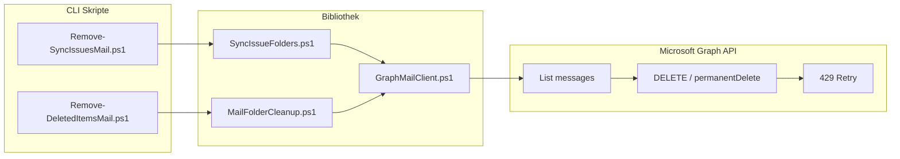

# M365 Mail Cleanup

[](LICENSE)

PowerShell-Tools zum Bereinigen von Exchange-Online-Postfachordnern über die **Microsoft Graph API**.

Open-Source-Werkzeuge für IT-Admins, die große Mengen an Sync-Fehler-Mails oder Papierkorb-Inhalte zuverlässig und throttling-sicher entfernen müssen — ohne EWS oder veraltete Exchange-Cmdlets.

## Features

| Skript | Zielordner | Funktion |
|---|---|---|
| [`Remove-SyncIssuesMail.ps1`](Remove-SyncIssuesMail.ps1) | Sync-Issues-Bereich | Synchronisierungsprobleme leeren |
| [`Remove-DeletedItemsMail.ps1`](Remove-DeletedItemsMail.ps1) | Gelöschte Elemente | Papierkorb endgültig leeren |

**Gemeinsame Eigenschaften:**

- `-DryRun` — nur zählen und anzeigen, nichts löschen
- `-HardDelete` — permanentes Löschen (nicht wiederherstellbar)
- `-Confirm` — interaktive Bestätigung vor Löschung
- Fortschrittsmeldung alle 50 verarbeiteten Mails
- Automatisches Retry bei Graph-Throttling (HTTP 429)
- Delegierte oder App-only Authentifizierung (Zertifikat)

---

## Voraussetzungen

- **Windows** mit **PowerShell 7+**
- Modul `Microsoft.Graph.Authentication`
- Microsoft 365 Postfach mit `Mail.ReadWrite`-Berechtigung

```powershell
Install-Module Microsoft.Graph.Authentication -Scope CurrentUser
```

---

## Schnellstart

```powershell
cd C:\Pfad\zu\m365-mail-cleanup
```

### Sync-Issues (Synchronisierungsprobleme)

```powershell
# Vorschau
.\Remove-SyncIssuesMail.ps1 -UserPrincipalName user@domain.de -DryRun

# Soft-Delete (Papierkorb) mit Bestätigung
.\Remove-SyncIssuesMail.ps1 -UserPrincipalName user@domain.de -Confirm

# Permanent Delete
.\Remove-SyncIssuesMail.ps1 -UserPrincipalName user@domain.de -HardDelete -Confirm
```

**Betroffene Ordner:**

| Well-Known Name | Outlook (DE) |
|---|---|
| `syncissues` | Synchronisierungsprobleme |
| `conflicts` | Konflikte |
| `localfailures` | Lokale Fehler |
| `serverfailures` | Serverfehler |
| + Unterordner | weitere Child-Folders unter `syncissues` |

### Gelöschte Elemente (Papierkorb)

```powershell
# Vorschau: zählen + erste 25 Mails (Datum, Absender, Betreff)
.\Remove-DeletedItemsMail.ps1 -UserPrincipalName user@domain.de -DryRun

# Mehr Vorschau-Einträge
.\Remove-DeletedItemsMail.ps1 -UserPrincipalName user@domain.de -DryRun -PreviewCount 100

# Endgültig leeren (-HardDelete ist Pflicht)
.\Remove-DeletedItemsMail.ps1 -UserPrincipalName user@domain.de -HardDelete -Confirm
```

> **Wichtig:** Ein normaler `DELETE` auf Mails in „Gelöschte Elemente" verschiebt sie nur nach `recoverableitemsdeletions` — der Ordner bleibt voll. Für echtes Leeren ist `-HardDelete` erforderlich.

### Mit Logdatei

```powershell
.\Remove-SyncIssuesMail.ps1 -UserPrincipalName user@domain.de -HardDelete -Confirm -LogPath .\logs\cleanup.log
```

Beim ersten Lauf öffnet sich ein Browser-Fenster für die Anmeldung (`Mail.ReadWrite`).

---

## Parameter

### Remove-SyncIssuesMail.ps1

| Parameter | Beschreibung |
|---|---|
| `-UserPrincipalName` | Ziel-Postfach (UPN), **Pflicht** |
| `-DryRun` | Nur zählen und Schätzung anzeigen |
| `-HardDelete` | Permanent Delete statt Papierkorb |
| `-Confirm` | Interaktive Bestätigung |
| `-LogPath` | Pfad zur Logdatei |
| `-UseDelegatedAuth` | Delegierte Anmeldung erzwingen |
| `-ConfigPath` | Pfad zu `config.json` für App-only Auth |

### Remove-DeletedItemsMail.ps1

| Parameter | Beschreibung |
|---|---|
| `-UserPrincipalName` | Ziel-Postfach (UPN), **Pflicht** |
| `-DryRun` | Zählen + Vorschau (Datum, Absender, Betreff) |
| `-HardDelete` | **Pflicht für Löschung** — permanent entfernen |
| `-PreviewCount` | Anzahl Vorschau-Mails im DryRun (Standard: 25) |
| `-Confirm` | Interaktive Bestätigung |
| `-LogPath` | Pfad zur Logdatei |

---

## Authentifizierung

### Modus A: Delegiert (empfohlen für Ersteinsatz)

Kein App Registration nötig. Admin meldet sich interaktiv an:

```powershell
Connect-MgGraph -Scopes Mail.ReadWrite
```

### Modus B: App-only (automatisierbar)

1. **Entra ID** → App registrations → New registration
2. **Zertifikat** hinterlegen (kein Client Secret im Klartext):

```powershell
$cert = New-SelfSignedCertificate -Subject "CN=M365-MailCleanup" `
    -CertStoreLocation "Cert:\CurrentUser\My" `
    -KeyExportPolicy Exportable -KeySpec Signature `
    -KeyLength 2048 -KeyAlgorithm RSA -HashAlgorithm SHA256
$cert.Thumbprint
```

3. **API Permission:** `Microsoft Graph` → `Mail.ReadWrite` (Application) + Admin Consent
4. **RBAC for Applications** — Zugriff auf Ziel-Mailboxen einschränken
5. Konfiguration:

```powershell
Copy-Item .\config.example.json .\config.json
# TenantId, ClientId, CertificateThumbprint eintragen
```

```powershell
.\Remove-SyncIssuesMail.ps1 -UserPrincipalName user@domain.de -ConfigPath .\config.json -DryRun
```

---

## Microsoft Graph Rate Limits

Microsoft Graph erzwingt **pro App + Mailbox** feste Limits (nicht erhöhbar):

| Limit | Wert | Auswirkung |
|---|---|---|
| Requests / 10 Min. | 10.000 | Für typische Volumen kein Engpass |
| Parallele Requests | **4** | Harte Obergrenze pro Mailbox |
| JSON-Batch | max. 20/Batch, aber nur 4 parallel | Batch spart Roundtrips, nicht Concurrency |
| Throttling | HTTP 429 + `Retry-After` | Automatisches Retry mit Backoff |

**Zeitschätzung:**

| Mails | Geschätzte Dauer |
|---|---|
| ~1.000 | 10–20 Minuten |
| ~2.500 | 25–50 Minuten |

Das Tool verarbeitet in Batches à 100 Mails mit maximal 4 parallelen Deletes und meldet Fortschritt alle 50 Mails:

```
[INFO] Progress: 50 / 1067 processed (50 deleted, 0 failed).
[INFO] Progress: 100 / 1067 processed (100 deleted, 0 failed).
```

Solange diese Zeilen weiterlaufen, arbeitet das Skript aktiv.

---

## Löschmodi

| Modus | API-Aufruf | Ergebnis | Wiederherstellung |
|---|---|---|---|
| Soft-Delete (Standard) | `DELETE /messages/{id}` | Mail → Papierkorb | Ja, über OWA/Outlook |
| Hard-Delete (`-HardDelete`) | `POST /messages/{id}/permanentDelete` | Mail → Purges (Dumpster) | Nein* |

\* Ausnahme: aktiver Litigation Hold oder In-Place Hold verzögert die endgültige Entfernung.

### Gelöschte Elemente: Warum nur HardDelete?

| Aktion | Ergebnis |
|---|---|
| `DELETE` auf Mail in Gelöschte Elemente | Verschiebt nach `recoverableitemsdeletions` — Ordner bleibt voll |
| `permanentDelete` (`-HardDelete`) | Endgültige Entfernung — Ordner wird leer |

---

## Architektur

```
m365-mail-cleanup/
├── Remove-SyncIssuesMail.ps1     # Sync-Issues: Orchestrierung + CLI
├── Remove-DeletedItemsMail.ps1   # Gelöschte Elemente: Orchestrierung + CLI
├── lib/
│   ├── GraphMailClient.ps1       # Auth, Graph-Requests, Batch-Delete, Retry
│   ├── SyncIssueFolders.ps1      # Sync-Issues Ordner-Discovery
│   └── MailFolderCleanup.ps1     # Generische DryRun/Clear-Logik
├── config.example.json           # Vorlage App-only Auth
├── .gitignore
└── README.md
```



### Technische Entscheidungen

| Ansatz | Bewertung | Grund |
|---|---|---|
| **Microsoft Graph** | Empfohlen | Well-Known Folder Names, Zukunftssicher (EWS wird 2026/2027 abgeschaltet) |
| Exchange Online PowerShell | Nicht geeignet | `Search-Mailbox` kann keinen bestimmten Ordner ansprechen |
| EWS | Nur Notfall | `Folder.Empty()` funktioniert, aber deprecated + Timeouts bei großen Ordnern |

---

## DryRun-Verhalten

`-DryRun` führt **nur Lesezugriffe** aus:

1. Anmeldung bei Microsoft Graph
2. Ordner finden / Zugang prüfen
3. Nachrichten zählen (via `$count=true` oder Paginierung)
4. Tabelle mit Anzahl und geschätzter Dauer ausgeben
5. Beenden — **kein DELETE, keine Änderung**

Bei `Remove-DeletedItemsMail.ps1` zeigt DryRun zusätzlich eine Vorschau der ersten Mails (Datum, Absender, Betreff).

---

## Hinweise nach der Bereinigung

**Sync-Issues** füllen sich oft erneut, wenn die Ursache nicht behoben wird:

- Outlook-Profil / OST neu erstellen
- Suchindex-Rebuild: `New-MoveRequest -Identity <user>` (Exchange Online PowerShell)
- Sync-Konflikte in Outlook/OWA prüfen

**Gelöschte Elemente** nach HardDelete: Ordner sollte leer sein. Bei Holds können Reste in Purges verbleiben.

---

## Fehlerbehebung

| Problem | Lösung |
|---|---|
| `403 Forbidden` | `Mail.ReadWrite` prüfen, Admin Consent, RBAC/App Access Policy |
| `404` auf Ordner | Ordner existiert nicht oder User hat kein Exchange-Postfach |
| `Cannot bind ... empty collection` | Behoben in v1 — `[AllowEmptyCollection()]` bei Mandatory-Parametern |
| `$FolderPath?` Parse-Fehler | Behoben in v1 — `${FolderPath}?` statt `$FolderPath?` (PS7 Null-Conditional) |
| Viele `429` Fehler | Normal bei hohem Volumen; Tool retried automatisch |
| Kein Fortschritt sichtbar | Behoben in v1 — Progress alle 50 Mails |
| Skript scheint zu hängen | Solange Progress-Zeilen kommen, arbeitet es; bei ~1000 Mails 10–20 Min. einplanen |
| Sync-Issues füllen sich wieder | Ursache beheben (OST, Suchindex, Sync-Konflikte) |
| HardDelete ohne Wirkung | Litigation/In-Place Hold prüfen |

---

## Lizenz

MIT License — siehe [LICENSE](LICENSE). Frei nutzbar, auch in kommerziellen Umgebungen.

## Hinweis

Dieses Projekt ist ein Community-Tool ohne offiziellen Microsoft-Support. Vor dem Einsatz in Produktionsumgebungen mit `-DryRun` testen.
